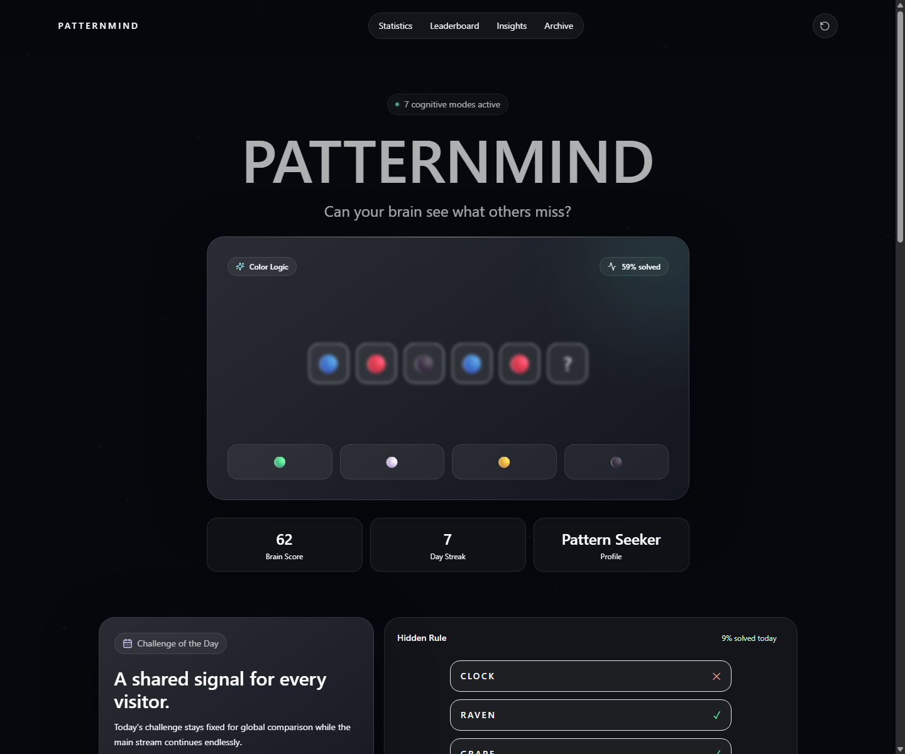
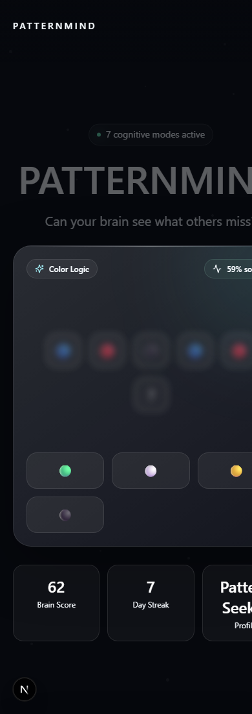

# 🧠 Pattern Mind


**A polished browser-based cognitive challenge game built with generated pattern, memory, logic, perception, and reasoning puzzles.**

> *Train focus through fast, visual challenges that ask you to recognize the rule before the next signal appears.*

Pattern Mind is an interactive Next.js game where players solve a continuous stream of generated cognitive challenges. Each round presents a visual, textual, matrix, hidden-rule, memory, or social-prediction puzzle, then asks the player to choose the correct answer from multiple options. The game tracks session progress with a brain score, skill scores, answer accuracy, streak count, challenge archive, and browser-based persistence through `localStorage`.

---

## 📋 Table of Contents

* [Key Features](#-key-features)
* [Gameplay](#-gameplay)
* [Tech Stack](#-tech-stack)
* [Repository Structure](#-repository-structure)
* [Installation](#-installation)
* [How to Play](#-how-to-play)
* [Controls](#-controls)
* [Game Architecture](#-game-architecture)
* [Screenshots](#-screenshots)
* [Live Demo](#-live-demo)
* [Limitations & Future Work](#%EF%B8%8F-limitations--future-work)
* [Contributing](#-contributing)
* [License](#-license)
* [Authors](#-authors)
* [Acknowledgments](#-acknowledgments)
* [Manual Edits Before Publishing](#-manual-edits-before-publishing)

---

## ✨ Key Features

* **Generated Challenge Stream:** Creates rounds from deterministic seeded logic across color, shape, symbol, number, matrix, hidden-rule, odd-object, memory, analogy, and social-prediction categories.
* **Memory Gameplay:** Includes timed memory rounds where symbols are shown briefly, hidden, and then recalled through a follow-up question.
* **Score and Progress Tracking:** Tracks attempted answers, correct answers, accuracy, streak, brain score, and category-specific skill scores.
* **Local Session Persistence:** Saves the active session to `localStorage` under `patternmind-session`.
* **Daily Challenge:** Generates a date-based challenge that remains fixed for the current day.
* **Animated Feedback:** Uses Framer Motion for card transitions, answer feedback, particle effects, hover motion, and success bursts.
* **Responsive Interface:** Uses Tailwind CSS utility classes and responsive grid layouts for desktop and mobile presentation.
* **Polished UI Sections:** Includes statistics, cognitive map, leaderboard, insights, challenge archive, and reset controls.

---

## 🎮 Gameplay

Pattern Mind asks the player to identify the missing rule, item, sequence value, visual oddity, or most likely answer from a set of options.

The main challenge card displays one generated puzzle at a time. Depending on the challenge type, the player may inspect a symbol sequence, complete a number progression, infer a hidden rule from examples, choose the missing matrix cell, find an odd object in a grid, answer an analogy prompt, predict a perception-based choice, or recall a previously shown memory grid.

After the player selects an answer, the game locks the options, highlights correct and incorrect feedback, shows an explanation, updates session statistics, and reveals a **Next** button. Correct answers increase the streak and raise the relevant skill score by a larger amount than incorrect answers. The reset button clears the active session back to the initial score values.

Memory rounds have a timed flow: the player sees a ready screen, studies the displayed slots, then answers only after the grid switches into recall mode.

---

## 🛠️ Tech Stack

| Technology | Purpose |
| ---------- | ------- |
| Next.js | App Router framework and project runtime |
| React | Component-based game interface and state management |
| TypeScript | Typed challenge models, session state, and logic |
| Tailwind CSS | Styling, responsive layout, and visual states |
| CSS3 | Global styles, custom utility classes, reduced-motion support, and glass effects |
| Framer Motion | Animations, transitions, motion values, and interactive feedback |
| lucide-react | Interface icons for navigation, feedback, stats, and controls |
| DOM / Browser APIs | Button interaction, anchor navigation, timers, and `localStorage` |

This project requires Node.js and npm because it is a Next.js application. It does not run as a standalone `index.html` file.

The code does **not** use Canvas API, Three.js, GSAP, p5.js, Phaser, Bootstrap, Web Audio API, or sound effects.

---

## 📂 Repository Structure

```text
pattern-mind/
│
├── app/
│   ├── globals.css
│   ├── layout.tsx
│   └── page.tsx
├── lib/
│   └── challenges.ts
├── patternmind-desktop-final.png
├── patternmind-desktop.png
├── patternmind-mobile.png
├── next-env.d.ts
├── next.config.ts
├── package-lock.json
├── package.json
├── postcss.config.mjs
├── tailwind.config.ts
├── tsconfig.json
└── README.md
```

| File / Folder | Purpose |
| ------------- | ------- |
| `app/page.tsx` | Main game UI, session state, answer handling, animations, statistics, archive, leaderboard, and reset flow |
| `app/layout.tsx` | Root layout and metadata for the PatternMind page |
| `app/globals.css` | Tailwind imports, global styling, glass effect, answer grid layout, and reduced-motion rules |
| `lib/challenges.ts` | Challenge types, seeded random generation, category logic, daily challenge generation, and archive generation |
| `tailwind.config.ts` | Tailwind content paths plus custom shadows, animations, and keyframes |
| `next.config.ts` | Next.js configuration with React strict mode |
| `package.json` | npm scripts and project dependencies |
| `patternmind-*.png` | Existing desktop and mobile screenshots |

---

## 🚀 Installation

Clone the repository:

```bash
git clone https://github.com/YOUR_USERNAME/pattern-mind.git
cd pattern-mind
```

Install dependencies:

```bash
npm install
```

Start the development server:

```bash
npm run dev
```

Open the local URL shown by Next.js, usually:

```text
http://localhost:3000
```

Available npm scripts from `package.json`:

```bash
npm run dev
npm run build
npm run start
npm run lint
```

---

## 🕹️ How to Play

1. Open the game in the browser.
2. Study the active challenge card.
3. Choose one of the displayed answer buttons.
4. Read the explanation after the answer is checked.
5. Press **Next** to continue to the next generated challenge.
6. Watch the brain score, streak, accuracy, and skill scores update as the session progresses.
7. Use the reset button in the top-right corner to restart the session.

---

## 🎯 Controls

| Action | Control |
| ------ | ------- |
| Select an answer | Mouse click or tap on an answer button |
| Continue after answering | **Next** button |
| Reset session | Circular reset button in the navigation bar |
| Jump to page sections | Navigation links for statistics, leaderboard, insights, and archive |

No keyboard controls are implemented in the current code.

---

## 🧠 Game Architecture

### 1. Game Initialization

The app starts in `app/page.tsx` as a client component. It initializes session state with default score values, then reads any saved session from `window.localStorage` after the component mounts.

### 2. State Management

The main session state tracks:

* `index` for the current generated challenge
* `streak` for consecutive correct answers
* `correct` and `attempted` answer counts
* skill scores for pattern, memory, logic, observation, and reasoning
* an archive of recently completed challenge IDs

The computed brain score is the average of the five skill scores. The profile label changes according to score thresholds defined in `app/page.tsx`.

### 3. Pattern Logic

Challenge generation lives in `lib/challenges.ts`. The game uses seeded random generation so an index consistently maps to a generated challenge. `generateChallenge()` rotates through ten categories:

* Color Logic
* Shape Logic
* Symbol Logic
* Sequence Logic
* Matrix Reasoning
* Hidden Rule
* Visual Perception
* Memory
* Analogy Reasoning
* Social Prediction

Each challenge includes its display mode, options, correct answer, explanation, difficulty, solved percentage, and associated skill.

### 4. User Interaction

Answer buttons call the `answer()` function in `app/page.tsx`. The selected option is compared with `challenge.answer`, then the UI locks the answer buttons, updates score state, stores the result, and triggers a success burst animation when correct.

Memory challenges use `window.setTimeout()` to move from ready, to study, to recall. Answer buttons are disabled until recall begins.

### 5. UI Rendering

`ChallengeVisual` renders the visual form for each challenge mode, including sequences, matrix grids, hidden-rule examples, odd-object grids, text prompts, and memory slots. `ChallengeCard` wraps the challenge in animated feedback, answer choices, explanation text, and the next-round action.

Supporting sections render the daily challenge, score cards, cognitive map, static leaderboard, insights, generated archive, and footer.

---

## 📸 Screenshots

[Add screenshot here]

Existing screenshot files in the repository:





---

## 🌐 Live Demo

[Play Pattern Mind here](https://YOUR_USERNAME.github.io/pattern-mind/)

---

## ⚠️ Limitations & Future Work

* [ ] Add more pattern types
* [ ] Add difficulty level selection
* [ ] Add sound feedback
* [ ] Add leaderboard data persistence or backend integration
* [ ] Add score history beyond the current saved session
* [ ] Improve accessibility for keyboard-only play
* [ ] Add dedicated automated tests for challenge generation
* [ ] Add a light theme

---

## 🤝 Contributing

Contributions are welcome. To propose a change:

1. Fork the repository.
2. Create a feature branch.
3. Make your changes.
4. Test the game locally.
5. Submit a pull request.

```bash
git checkout -b feature/your-feature-name
```

---

## 📜 License

This project is intended to be released under the **MIT License**. Add a `LICENSE` file before publishing if you want others to reuse or contribute to the project.

---

## 👨‍💻 Authors

| Name | GitHub |
| ---- | ------ |
| [Add your name here] | [@YOUR_USERNAME](https://github.com/YOUR_USERNAME) |

---

## 🙌 Acknowledgments

* Browser APIs used for local session storage and timed memory rounds
* Next.js, React, TypeScript, Tailwind CSS, Framer Motion, and lucide-react
* Classic pattern-recognition, memory, logic, and visual-perception puzzle formats

---

## ✅ Manual Edits Before Publishing

* Replace `YOUR_USERNAME`
* Add real screenshot
* Add GitHub Pages link
* Confirm author name
* Confirm license
* Test all links
* Make sure screenshots and live demo links are not inside code blocks
